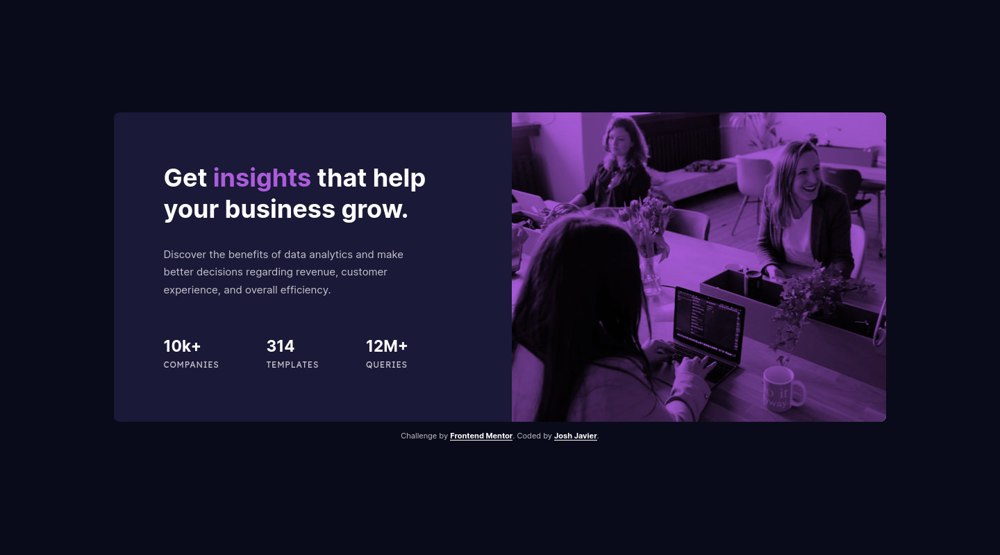
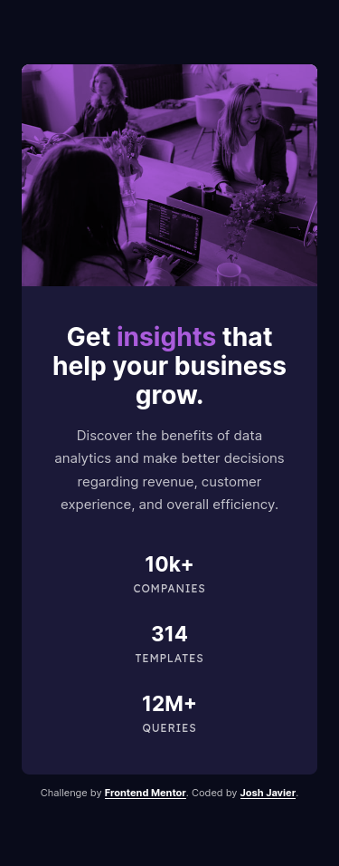

# Frontend Mentor - Stats preview card component solution

This is a solution to the [Stats preview card component challenge on Frontend Mentor](https://www.frontendmentor.io/challenges/stats-preview-card-component-8JqbgoU62). Frontend Mentor challenges help you improve your coding skills by building realistic projects. 

## Table of contents

- [Overview](#overview)
  - [The challenge](#the-challenge)
  - [Screenshot](#screenshot)
  - [Links](#links)
- [My process](#my-process)
  - [Built with](#built-with)
  - [What I learned](#what-i-learned)
  - [Continued development](#continued-development)
  - [Useful resources](#useful-resources)
- [Author](#author)
- [Acknowledgments](#acknowledgments)

## Overview

### The challenge

Users should be able to:

- View the optimal layout depending on their device's screen size

### Screenshot

### Links

- Solution URL: [https://www.frontendmentor.io/solutions/stats-preview-card-component-using-flexbox-UvIcVPS9U](https://www.frontendmentor.io/solutions/stats-preview-card-component-using-flexbox-UvIcVPS9U)
- Live Site URL: [https://joshjavier.github.io/stats-preview-card-component/](https://joshjavier.github.io/stats-preview-card-component/)

## My process

### Built with

- Semantic HTML5 markup
- CSS custom properties
- Flexbox
- Mobile-first workflow

### What I learned

While doing accessibility testing for this solution (I used VoiceOver in my iPhone), I found that the title breaks up because of the highlighted span (**insights**). This leads to a bad experience for screen readers, so to fix this, I wrapped my header content in a span with `role="text"`. I did the same to the list items to also prevent them from text splitting.

### Continued development

I thought it's unnecessary for this project, but for bigger projects in the future I'd like to use a [flow CSS utility](https://piccalil.li/quick-tip/flow-utility/) for adding space between flow elements. Maybe try using Sass, too?

### Useful resources

- [Text Splitting Causes Screen Reader Problems](https://axesslab.com/text-splitting/) - This article by Daniel Göransson, a screen reader user, helped me to fix an issue with VoiceOver splitting the `h1` element because of the `strong` span.
- [Tinted Images with Multiple Backgrounds](https://css-tricks.com/tinted-images-multiple-backgrounds/) - This article helped me implement the duotone effect in the header image.
- [Aspect Ratio Boxes](https://css-tricks.com/aspect-ratio-boxes/) - This article talks about the "padding trick" used to achieve a consistent aspect ratio for the header to contain the image properly. (I actually used a simpler implementation like in this [StackOverflow answer](https://stackoverflow.com/a/22211990/11619513).)
- [Ratio Buddy](https://ratiobuddy.com/) - Nifty tool for calculating the value needed for the padding trick mentioned above.
- [CSS Media queries: grouped with rule-sets or grouped at the bottom?](https://dev.to/jsn1nj4/css-media-queries-grouped-with-rule-sets-or-grouped-at-the-bottom-3ig2) - This quick read gives a look at two common ways to group CSS media queries.

## Author

- Website - [Josh Javier](https://joshjavier.com/)
- Frontend Mentor - [@joshjavier](https://www.frontendmentor.io/profile/joshjavier)
- Twitter - [@joshjavierr](https://twitter.com/joshjavierr)
- Codepen - [@joshjavier](https://codepen.io/joshjavier/)